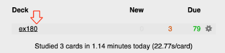

**EX180 Anki Deck**

Flash cards to assist studying for the RedHat EX180

Total number of questions: 82

\*\* You may need to change the Anki's "daily limits" to review all questions in a single session. Please see Anki Tips (below)

Anki version used to create cards: Version 2.1.49

**Steps:**

1. Download and install Anki: [https://apps.ankiweb.net/](https://apps.ankiweb.net/)

2. Run the Anki app and import the 'ex180.apkg'

3. Click the deck "ex180"

4. Start Studying

**Anki tips:**

1. Answer each question by typing and then pressing ENTER key

1. Based on the question and answer, assign the right rating to it (in terms of when you want to review again)

1. You may also try "Custom Study" option

1. To review all questions without any daily limits, change the settings as below:

Click the gear icon for the ex180 deck, select "Options" and change the "new cards/day" setting to 100 and "Maximum reviews/day" to 1000. Click "Save"

 

**Author:**

Muneeb Ahmad

https://linkedin.com/in/muneebsa/